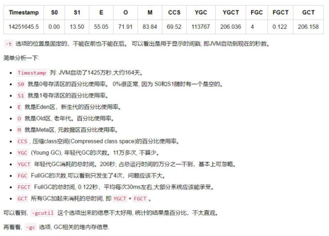
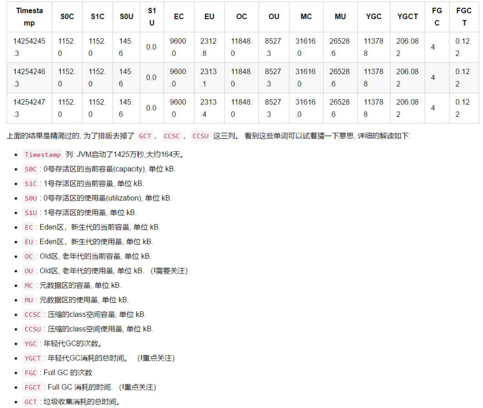

jps
```
-- 查看java进程
[root@master ~]# jps
10944 jar
24282 Jps
-- 查看java进程详细信息（买LV）
[root@master ~]# jps -mlv
10944 demo-0.0.1-SNAPSHOT.jar
25088 sun.tools.jps.Jps -mlv -Dapplication.home=/usr/java/jdk1.8.0_231-amd64 -Xms8m
```
jstat
```
-- 垃圾回收信息，每个1000毫秒，打印1000次
[root@master ~]# jstat -gcutil 10944 1000 1000
  S0     S1     E      O      M     CCS    YGC     YGCT    FGC    FGCT     GCT   
 99.31   0.00  11.20  32.19  93.50  90.33     10    0.149     1    0.046    0.194
 99.31   0.00  11.20  32.19  93.50  90.33     10    0.149     1    0.046    0.194
 99.31   0.00  11.20  32.19  93.50  90.33     10    0.149     1    0.046    0.194
 99.31   0.00  11.20  32.19  93.50  90.33     10    0.149     1    0.046    0.194
```

```

[root@master ~]# jstat -gc 10944 1000 1000
 S0C    S1C    S0U    S1U      EC       EU        OC         OU       MC     MU    CCSC   CCSU   YGC     YGCT    FGC    FGCT     GCT   
4608.0 5632.0 4576.0  0.0   137728.0 15419.8   23040.0     7417.2   29440.0 27525.9 3840.0 3468.9     10    0.149   1      0.046    0.194
4608.0 5632.0 4576.0  0.0   137728.0 15419.8   23040.0     7417.2   29440.0 27525.9 3840.0 3468.9     10    0.149   1      0.046    0.194
```

