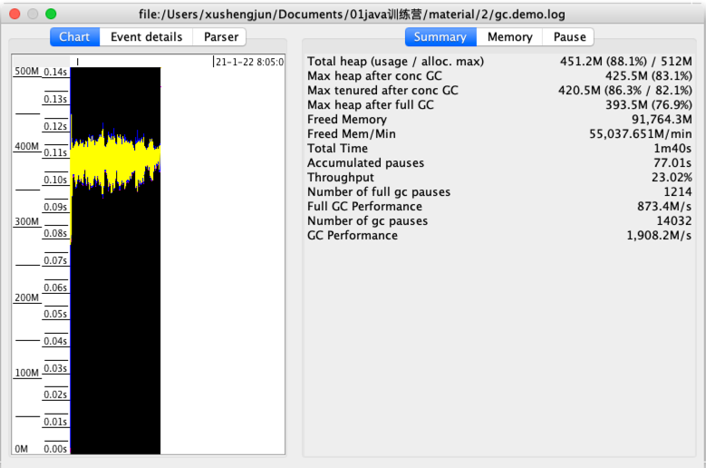
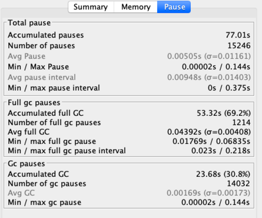
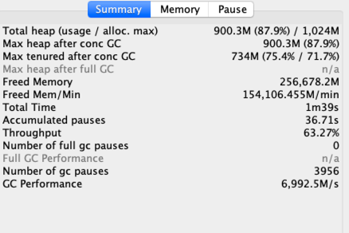
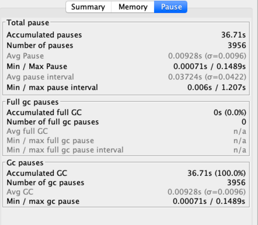
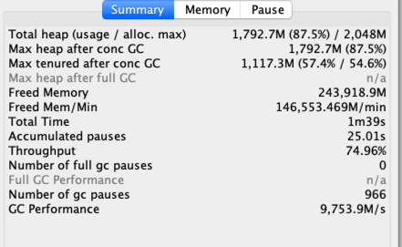
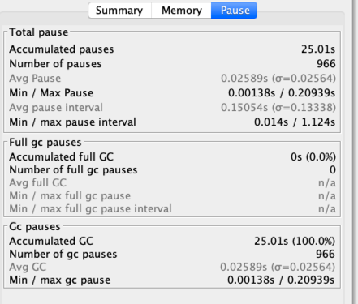
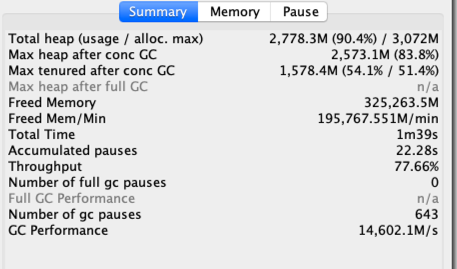
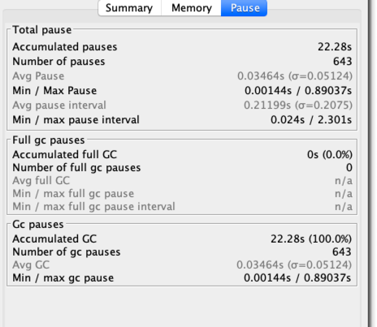
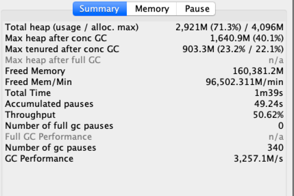
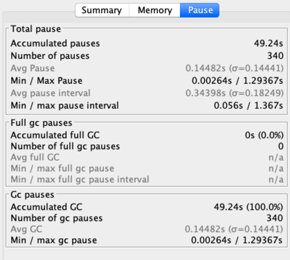

###1. -Xmx256m -Xms256m
```
java -Xmx256m -Xms256m -XX:+UseG1GC -XX:+PrintGCDateStamps -XX:+PrintGCDetails -Xloggc:gc.demo.log GCLogAnalysis
正在执行...
Exception in thread "main" java.lang.OutOfMemoryError: Java heap space
at GCLogAnalysis.generateGarbage(GCLogAnalysis.java:42)
at GCLogAnalysis.main(GCLogAnalysis.java:25)

```
###2. -Xmx512m -Xms512m
```
java -Xmx512m -Xms512m -XX:+UseG1GC -XX:+PrintGCDateStamps -XX:+PrintGCDetails -Xloggc:gc.demo.log GCLogAnalysis
正在执行...
执行结束!共生成对象次数:331674
```
- Summary选项卡提供了吞吐量性能指标

重要数据：
吞吐量只有23.02%
GC 暂停总次数：15246
Full GC暂停次数：1214
GC总暂停时间：77.01s
>解读：
可知GC暂停时间55%，严重影响了吞吐量
- Pause提供了延迟指标

  GC总暂停时间：77.01s
Full gc暂停占据了69.2%
>解读:
> 总暂停时间太长，Full GC比重很大，堆内存太小

根据以上分析解读如下：
1.吞吐量太低
2.堆内存不足，因为77.01s Full gc暂停占据了69.2%，且gc后，老年代堆使用率仍高居82.1%左右
可能是堆内存过小或有内存泄漏
###3.java -Xmx1g -Xms1g
```
java -Xmx1g -Xms1g -XX:+UseG1GC -XX:+PrintGCDateStamps -XX:+PrintGCDetails -Xloggc:gc.demo.log GCLogAnalysis 
正在执行...
执行结束!共生成对象次数:934352

```


>解读
> 将堆内存扩大到1g后，吞吐量提升到63.27%，GC总暂停时间降低到36.71s
> full gc次数为0
>但是吞吐量还是很低，按照经验, 低于 90% 的有效时间就值得警惕了, 可能需要好好优化下GC
> gc后，老年代堆使用率仍高居71.7%
>可能是堆内存过小或有内存泄漏

###4.java -Xmx2g -Xms2g
```
java -Xmx2g -Xms2g -XX:+UseG1GC -XX:+PrintGCDateStamps -XX:+PrintGCDetails -Xloggc:gc.demo.log GCLogAnalysis 
正在执行...
执行结束!共生成对象次数:889246
```


>吞吐量提升到74.96%
###5.java -Xmx3g -Xms3g
```
java -Xmx3g -Xms3g -XX:+UseG1GC -XX:+PrintGCDateStamps -XX:+PrintGCDetails -Xloggc:gc.demo.log GCLogAnalysis 
正在执行...
执行结束!共生成对象次数:1190734

```



###6.java -Xmx4g -Xms4g
```
java -Xmx4g -Xms4g -XX:+UseG1GC -XX:+PrintGCDateStamps -XX:+PrintGCDetails -Xloggc:gc.demo.log GCLogAnalysis 
正在执行...
执行结束!共生成对象次数:595959
```



- G1演练结果

| 堆内存 | 吞吐量 | GC总暂停时间 |Full GC总暂停时间 | GC后老年代使用率| 创建对象数量|
| :------| ------: | :------: |------: | :------: |:------: |
| 512m | 23.02% | 77.01s |53.52s | 82.01% | 331674|
| 1g | 63.27% | 36.71s |0s | 71.7% | 934352|
| 2g | 74.96% | 25.01s |0s | 54.6% | 889246|
| 3g | 77.66% | 22.28s |0s | 51.4% | 1190734|
| 4g | 50.62% | 49.24s |0s | 22.1% | 595959|

>由上表可知，吞吐量随着堆内存变大，先增大再减小
> <br> 扩大堆内存可以提升吞吐量，但并不是堆内存越大越好，堆超过某个合适值，会使GC的暂停时间增大，吞吐量反而减小
> 