### 一、jvm命令查看jvm情况
1. 串行化GC
```
[root@master java]# java -jar -XX:-UseAdaptiveSizePolicy -XX:+UseSerialGC gateway-server-0.0.1-SNAPSHOT.jar 
```
- jmap

由下可知，最大堆内存712.0MB，新生代:老年代=1：2，eden:s0:s1=8:1:1
因此，新生代最大内存等于712/3=237.MB.
Eden=12.375MB，From Space=To Space=1.5MB，符合8:1:1
```
[root@master ~]# jmap -heap 8209
Attaching to process ID 8209, please wait...
Debugger attached successfully.
Server compiler detected.
JVM version is 25.231-b11

using thread-local object allocation.
Mark Sweep Compact GC  --标记-清除-整理GC算法

Heap Configuration:
   MinHeapFreeRatio         = 40
   MaxHeapFreeRatio         = 70
   MaxHeapSize              = 746586112 (712.0MB)
   NewSize                  = 16056320 (15.3125MB)
   MaxNewSize               = 248840192 (237.3125MB)
   OldSize                  = 32178176 (30.6875MB)
   NewRatio                 = 2
   SurvivorRatio            = 8
   MetaspaceSize            = 21807104 (20.796875MB)
   CompressedClassSpaceSize = 1073741824 (1024.0MB)
   MaxMetaspaceSize         = 17592186044415 MB
   G1HeapRegionSize         = 0 (0.0MB)

Heap Usage:
New Generation (Eden + 1 Survivor Space):
   capacity = 14548992 (13.875MB)
   used     = 7806960 (7.4452972412109375MB)
   free     = 6742032 (6.4297027587890625MB)
   53.6597999366554% used
Eden Space:
   capacity = 12976128 (12.375MB)
   used     = 6755808 (6.442840576171875MB)
   free     = 6220320 (5.932159423828125MB)
   52.063358191287875% used
From Space:
   capacity = 1572864 (1.5MB)
   used     = 1051152 (1.0024566650390625MB)
   free     = 521712 (0.4975433349609375MB)
   66.8304443359375% used
To Space:
   capacity = 1572864 (1.5MB)
   used     = 0 (0.0MB)
   free     = 1572864 (1.5MB)
   0.0% used
tenured generation:  --当前old区内存使用情况
   capacity = 32178176 (30.6875MB)
   used     = 20282384 (19.342788696289062MB)
   free     = 11895792 (11.344711303710938MB)
   63.03149066000509% used

15494 interned Strings occupying 2130904 bytes
```
- jstat -gc 8209 1000 1000
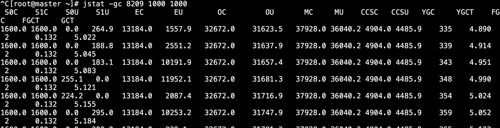

- jstack -l
```
^C[root@master ~]# jstack -l 8209
2021-01-13 15:30:26
Full thread dump Java HotSpot(TM) 64-Bit Server VM (25.231-b11 mixed mode):

"Attach Listener" #130 daemon prio=9 os_prio=0 tid=0x00007fea2800e000 nid=0x5cce waiting on condition [0x0000000000000000]
   java.lang.Thread.State: RUNNABLE

   Locked ownable synchronizers:
	- None
```
2. 并行化GC

由下可知，最大堆内存1024MB，新生代:老年代=1：2，eden:s0:s1=8:1:1
因此，新生代最大内存等于1024/3=341.MB.
Eden=256MB，From Space=To Space=42.5MB，是6:1:1
```
java -Xmx1g -Xms1g -XX:-UseAdaptiveSizePolicy -XX:+UseParallelGC -jar gateway-server-0.0.1-SNAPSHOT.jar

[root@master ~]# jmap -heap 10247
Attaching to process ID 10247, please wait...
Debugger attached successfully.
Server compiler detected.
JVM version is 25.231-b11

using thread-local object allocation.
Parallel GC with 2 thread(s)

Heap Configuration:
   MinHeapFreeRatio         = 40
   MaxHeapFreeRatio         = 70
   MaxHeapSize              = 1073741824 (1024.0MB)
   NewSize                  = 357564416 (341.0MB)
   MaxNewSize               = 357564416 (341.0MB)
   OldSize                  = 716177408 (683.0MB)
   NewRatio                 = 2
   SurvivorRatio            = 8
   MetaspaceSize            = 21807104 (20.796875MB)
   CompressedClassSpaceSize = 1073741824 (1024.0MB)
   MaxMetaspaceSize         = 17592186044415 MB
   G1HeapRegionSize         = 0 (0.0MB)

Heap Usage:
PS Young Generation
Eden Space:
   capacity = 268435456 (256.0MB)
   used     = 105203888 (100.33024597167969MB)
   free     = 163231568 (155.6697540283203MB)
   39.19150233268738% used
From Space:
   capacity = 44564480 (42.5MB)
   used     = 17780024 (16.95635223388672MB)
   free     = 26784456 (25.54364776611328MB)
   39.897299373851105% used
To Space:
   capacity = 44564480 (42.5MB)
   used     = 0 (0.0MB)
   free     = 44564480 (42.5MB)
   0.0% used
PS Old Generation
   capacity = 716177408 (683.0MB)
   used     = 5334936 (5.087791442871094MB)
   free     = 710842472 (677.9122085571289MB)
   0.7449182200396917% used

15197 interned Strings occupying 2074584 bytes.
[root@master ~]# 
```
3. CMS GC

最大young区大小，超过8线程就是Xmx的1/3，8线程内是64×并发线程数×13/10
我的电脑2核，即2线程。
64*2*13/10=166.4，符合
```
java -Xmx1g -Xms1g -XX:-UseAdaptiveSizePolicy -XX:+UseConcMarkSweepGC -jar gateway-server-0.0.1-SNAPSHOT.jar 

[root@master ~]# jmap -heap 16301
Attaching to process ID 16301, please wait...
Debugger attached successfully.
Server compiler detected.
JVM version is 25.231-b11

using parallel threads in the new generation.
using thread-local object allocation.
Concurrent Mark-Sweep GC

Heap Configuration:
   MinHeapFreeRatio         = 40
   MaxHeapFreeRatio         = 70
   MaxHeapSize              = 1073741824 (1024.0MB)
   NewSize                  = 174456832 (166.375MB)
   MaxNewSize               = 174456832 (166.375MB)
   OldSize                  = 899284992 (857.625MB)
   NewRatio                 = 2
   SurvivorRatio            = 8
   MetaspaceSize            = 21807104 (20.796875MB)
   CompressedClassSpaceSize = 1073741824 (1024.0MB)
   MaxMetaspaceSize         = 17592186044415 MB
   G1HeapRegionSize         = 0 (0.0MB)

Heap Usage:
New Generation (Eden + 1 Survivor Space):
   capacity = 157024256 (149.75MB)
   used     = 95396840 (90.9775161743164MB)
   free     = 61627416 (58.772483825683594MB)
   60.752932336772226% used
Eden Space:
   capacity = 139591680 (133.125MB)
   used     = 77964280 (74.35253143310547MB)
   free     = 61627400 (58.77246856689453MB)
   55.85166680421068% used
From Space:
   capacity = 17432576 (16.625MB)
   used     = 17432560 (16.624984741210938MB)
   free     = 16 (1.52587890625E-5MB)
   99.99990821781014% used
To Space:
   capacity = 17432576 (16.625MB)
   used     = 0 (0.0MB)
   free     = 17432576 (16.625MB)
   0.0% used
concurrent mark-sweep generation:
   capacity = 899284992 (857.625MB)
   used     = 5832064 (5.5618896484375MB)
   free     = 893452928 (852.0631103515625MB)
   0.648522331839382% used

15491 interned Strings occupying 2126272 bytes.
```

```
java -Xmx1g -Xms1g -XX:-UseAdaptiveSizePolicy -XX:+UseG1GC  -jar gateway-server-0.0.1-SNAPSHOT.jar

[root@master ~]# jmap -heap 15899
Attaching to process ID 15899, please wait...
Debugger attached successfully.
Server compiler detected.
JVM version is 25.231-b11

using thread-local object allocation.
Garbage-First (G1) GC with 2 thread(s)

Heap Configuration:
MinHeapFreeRatio         = 40
MaxHeapFreeRatio         = 70
MaxHeapSize              = 1073741824 (1024.0MB)
NewSize                  = 1363144 (1.2999954223632812MB)
MaxNewSize               = 643825664 (614.0MB)
OldSize                  = 5452592 (5.1999969482421875MB)
NewRatio                 = 2
SurvivorRatio            = 8
MetaspaceSize            = 21807104 (20.796875MB)
CompressedClassSpaceSize = 1073741824 (1024.0MB)
MaxMetaspaceSize         = 17592186044415 MB
G1HeapRegionSize         = 1048576 (1.0MB)

Heap Usage:
G1 Heap:
regions  = 1024
capacity = 1073741824 (1024.0MB)
used     = 24641528 (23.49999237060547MB)
free     = 1049100296 (1000.5000076293945MB)
2.2949211299419403% used
G1 Young Generation:
Eden Space:
regions  = 1
capacity = 216006656 (206.0MB)
used     = 1048576 (1.0MB)
free     = 214958080 (205.0MB)
0.4854368932038835% used
Survivor Space:
regions  = 23
capacity = 24117248 (23.0MB)
used     = 24117248 (23.0MB)
free     = 0 (0.0MB)
100.0% used
G1 Old Generation:
regions  = 0
capacity = 833617920 (795.0MB)
used     = 0 (0.0MB)
free     = 833617920 (795.0MB)
0.0% used

15442 interned Strings occupying 2121112 bytes.
```
4. G1 GC

初始年轻代占整个Java Heap的大小，默认值为5%；
最大年轻代占整个Java Heap的大小，默认值为60%；
每个Region的大小，1048576 (1.0MB)

```
[root@master ~]# jmap -heap 15899
Attaching to process ID 15899, please wait...
Debugger attached successfully.
Server compiler detected.
JVM version is 25.231-b11

using thread-local object allocation.
Garbage-First (G1) GC with 2 thread(s)

Heap Configuration:
   MinHeapFreeRatio         = 40
   MaxHeapFreeRatio         = 70
   MaxHeapSize              = 1073741824 (1024.0MB)
   NewSize                  = 1363144 (1.2999954223632812MB)
   MaxNewSize               = 643825664 (614.0MB)
   OldSize                  = 5452592 (5.1999969482421875MB)
   NewRatio                 = 2
   SurvivorRatio            = 8
   MetaspaceSize            = 21807104 (20.796875MB)
   CompressedClassSpaceSize = 1073741824 (1024.0MB)
   MaxMetaspaceSize         = 17592186044415 MB
   G1HeapRegionSize         = 1048576 (1.0MB)  

Heap Usage:
G1 Heap:
   regions  = 1024
   capacity = 1073741824 (1024.0MB)
   used     = 324534768 (309.50047302246094MB)
   free     = 749207056 (714.4995269775391MB)
   30.2246555685997% used
G1 Young Generation:
Eden Space:
   regions  = 280
   capacity = 674234368 (643.0MB)
   used     = 293601280 (280.0MB)
   free     = 380633088 (363.0MB)
   43.54587869362364% used
Survivor Space:
   regions  = 2
   capacity = 2097152 (2.0MB)
   used     = 2097152 (2.0MB)
   free     = 0 (0.0MB)
   100.0% used
G1 Old Generation:
   regions  = 28
   capacity = 397410304 (379.0MB)
   used     = 28836336 (27.500473022460938MB)
   free     = 368573968 (351.49952697753906MB)
   7.256061483498928% used

16749 interned Strings occupying 2251872 bytes.
```
### 二、可视化工具分析jvm情况
- jconsole
```
-- UseSerialGC
java -Xmx1g -Xms1g -XX:-UseAdaptiveSizePolicy -XX:+UseSerialGC -jar gateway-server-0.0.1-SNAPSHOT.jar
压测
wrk -t10 -c100 -d60 http://localhost:8088/api/hello
通过jconsole查看jvm相关信息
1.压测100个线程，线程和内存都在压测期间突增，然后跌回原值，并维持稳定。
2.压测时，类数量和Metaspace区突增，并一直保持不变。
元数据区保存类信息，当元空间的当前容量已满时，也可能是在常规垃圾回收卸载类时，元数据区才被回收
3.压测开始后，堆中数据呈"栅栏式"，然后保持居高稳定缓升，在压测结束后"断崖式"下跌。
分析如下：
压测开始，Eden区生成大量对象，触发young GC，反复几次young GC后，对象被复制到
老年代。
当压测结束，年轻代中的对象被young GC迅速清理，由于老年代空间充足，没有触发major gc或full gc，
老年代的对象存储无变化。

```
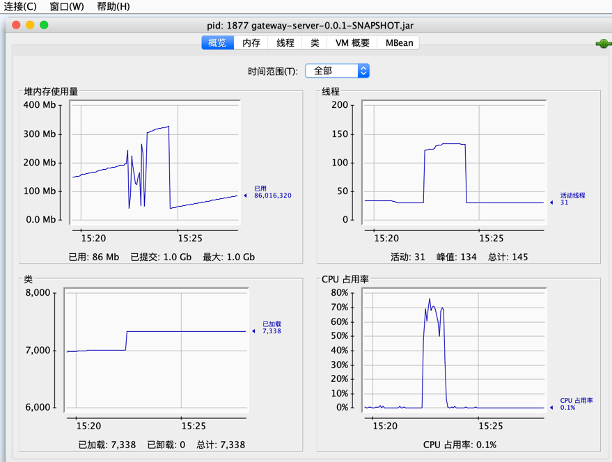
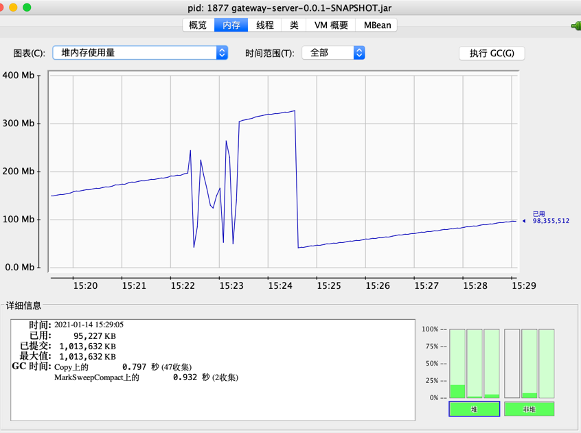
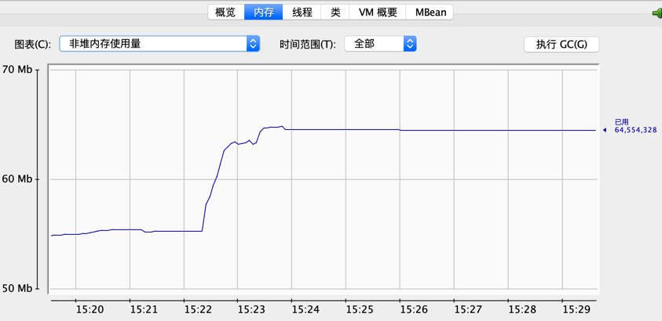
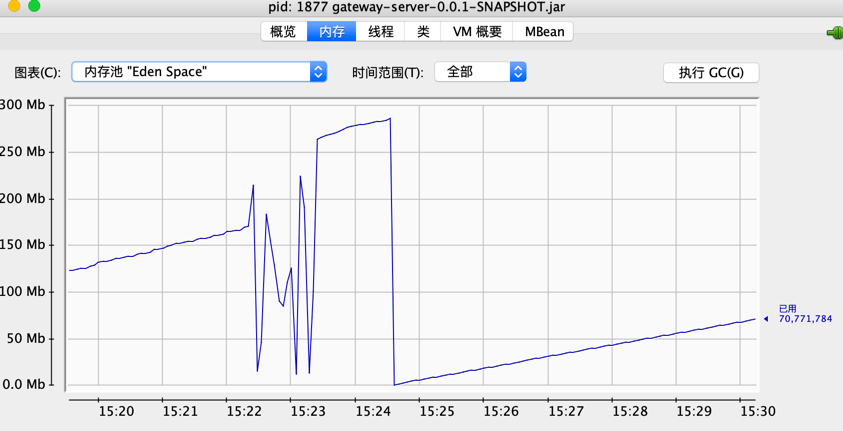
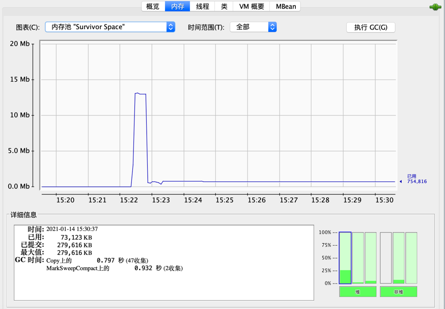
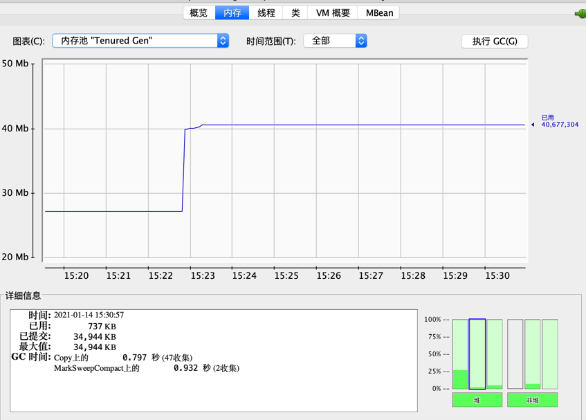
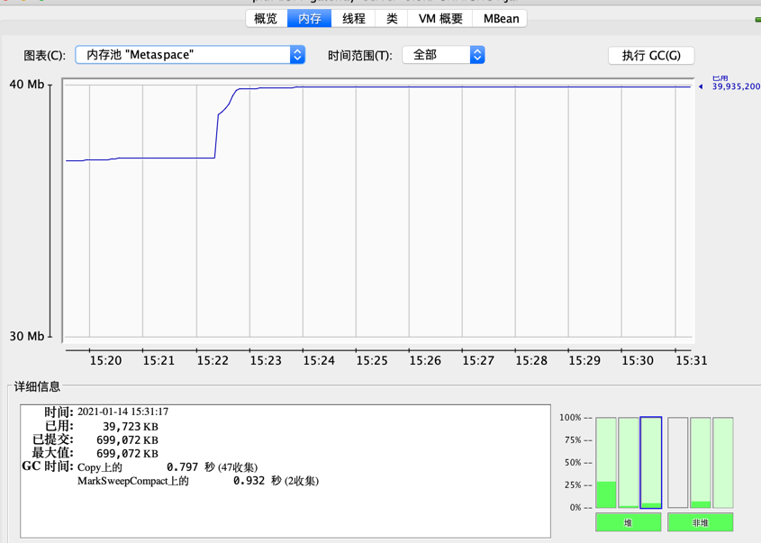
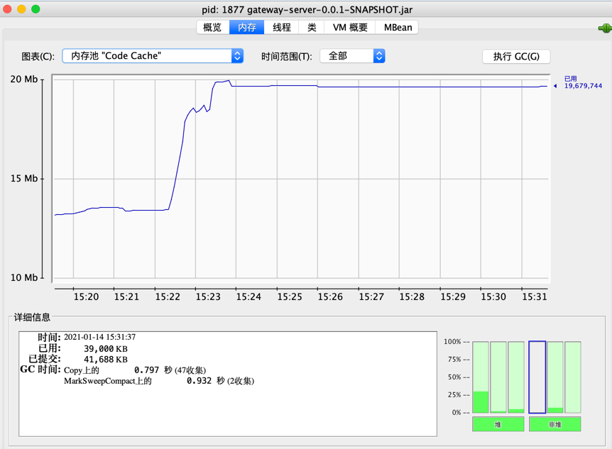
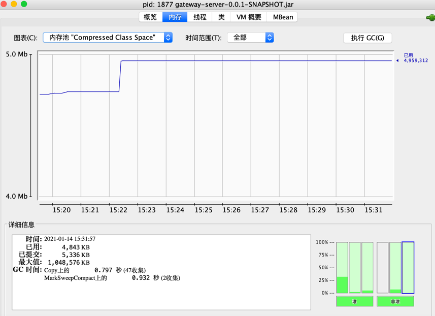

-- UseParallelGC
和串行比较，
并行GC，老年代发生两次并行gc，耗时0.252s
串行GC，老年代发生两次并行gc，耗时0.932s
性能是后者的3.6倍
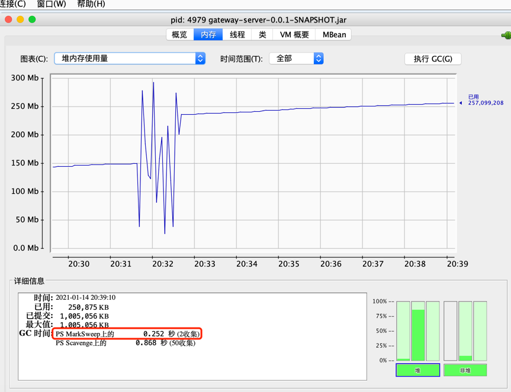


- Visual VM

再次压测，并使用Visual VM查看JVM信息，
CPU、线程、堆栈图的变化，和走向和第一次压测时，使用jconsole看到的差不多。
classe和metaspace几乎没变化，因为类信息第一次压测后没有回收。
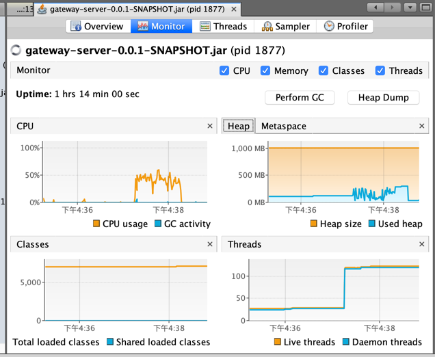
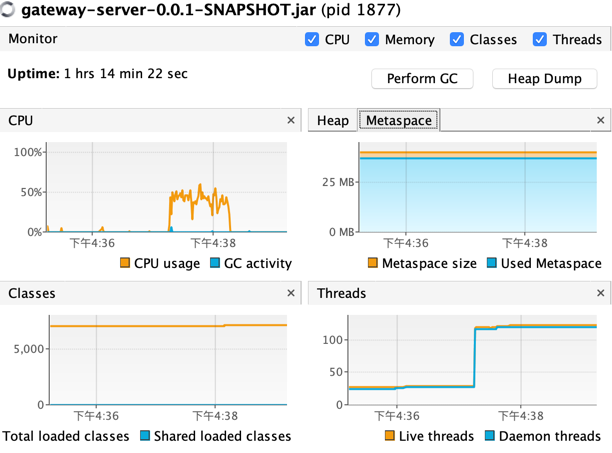
- JMC
  
  通过内存信息，我们可以清晰的看到垃圾收集器的类型，垃圾收集的暂停时间，包括最短暂停时间、平均暂停时间、最长暂停时间，以及更为重要的垃圾收集频率（垃圾收集的周期及STW时长）
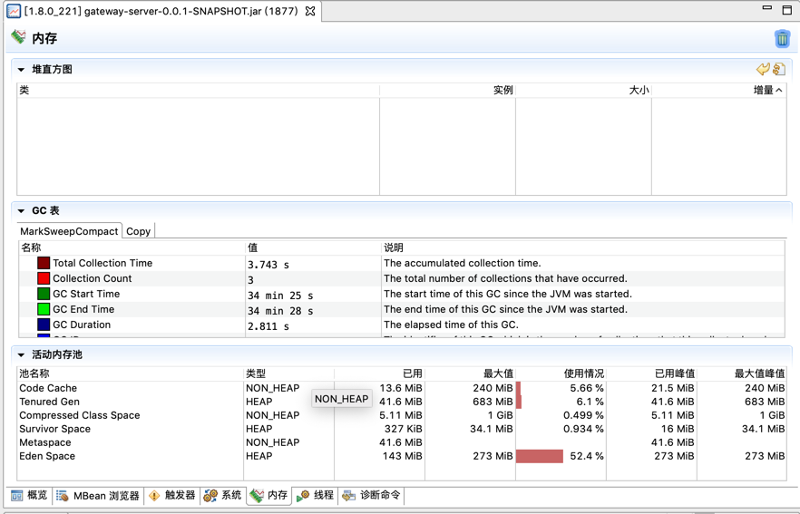
  **Java性能调优：利用JFR生成性能日志**
https://www.cnblogs.com/zhaoxinshanwei/p/8312730.html
  在收集jfr日志
  ```
  -- 启动参数中打开JFR
  java -Xmx1g -Xms1g -XX:-UseAdaptiveSizePolicy -XX:+UseSerialGC 
  -XX:+UnlockCommercialFeatures -XX:+FlightRecorder -Djavax.xml.parsers.SAXParserFactory=com.sun.org.apache.xerces.internal.jaxp.SAXParserFactoryImpl  
    -jar gateway-server-0.0.1-SNAPSHOT.jar 
  ```
  使用JFR记录期间，进行压测
生成jfr日志文件后，使用jmc打开，可以看到自动分析结果
  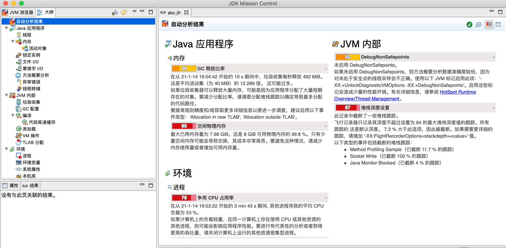
  
  