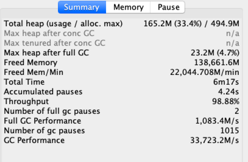
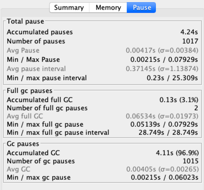
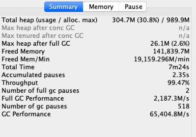
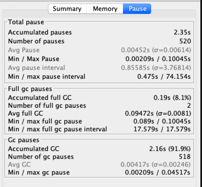
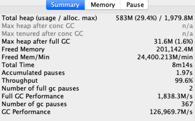
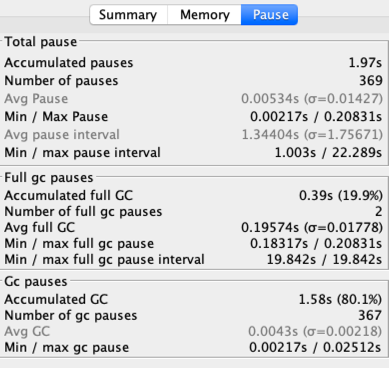

- -Xmx512m -Xms512m -XX:+UseSerialGC
```
java -jar -Xmx512m -Xms512m -XX:+UseSerialGC  -Xloggc:gateway.gc.demo.log gateway-server-0.0.1-SNAPSHOT.jar 

xushengjun@xushengjundeMBP:~$ wrk -c40 -d60s http://localhost:8088/api/hello
Running 1m test @ http://localhost:8088/api/hello
  2 threads and 40 connections
  Thread Stats   Avg      Stdev     Max   +/- Stdev
    Latency    10.74ms   27.23ms 446.10ms   93.02%
    Req/Sec     4.61k     1.90k   12.02k    66.72%
  547919 requests in 1.00m, 65.42MB read
Requests/sec:   9125.24
Transfer/sec:      1.09MB
xushengjun@xushengjundeMBP:~$ wrk -c40 -d60s http://localhost:8088/api/hello
Running 1m test @ http://localhost:8088/api/hello
  2 threads and 40 connections
  Thread Stats   Avg      Stdev     Max   +/- Stdev
    Latency     2.25ms    4.56ms 168.96ms   96.95%
    Req/Sec     9.27k     1.89k   15.09k    69.72%
  1106528 requests in 1.00m, 132.11MB read
Requests/sec:  18421.11
Transfer/sec:      2.20MB
xushengjun@xushengjundeMBP:~$ wrk -c40 -d60s http://localhost:8088/api/hello
Running 1m test @ http://localhost:8088/api/hello
  2 threads and 40 connections
  Thread Stats   Avg      Stdev     Max   +/- Stdev
    Latency     2.12ms    7.18ms 205.39ms   98.67%
    Req/Sec    10.34k     1.57k   15.35k    72.09%
  1233330 requests in 1.00m, 147.25MB read
Requests/sec:  20529.11
Transfer/sec:      2.45MB
xushengjun@xushengjundeMBP:~$ wrk -c40 -d60s http://localhost:8088/api/hello
Running 1m test @ http://localhost:8088/api/hello
  2 threads and 40 connections
  Thread Stats   Avg      Stdev     Max   +/- Stdev
    Latency     1.87ms    2.68ms  56.19ms   96.64%
    Req/Sec    10.30k     1.48k   14.66k    72.80%
  1230618 requests in 1.00m, 146.92MB read
Requests/sec:  20476.82
Transfer/sec:      2.44MB
xushengjun@xushengjundeMBP:~$ wrk -c40 -d60s http://localhost:8088/api/hello
Running 1m test @ http://localhost:8088/api/hello
  2 threads and 40 connections
  Thread Stats   Avg      Stdev     Max   +/- Stdev
    Latency     1.92ms    3.38ms  96.40ms   97.26%
    Req/Sec    10.20k     1.46k   14.89k    74.83%
  1218831 requests in 1.00m, 145.52MB read
Requests/sec:  20289.04
Transfer/sec:      2.42MB
```



- -Xmx1g -Xms1g -XX:+UseSerialGC
```
java -jar -Xmx1g -Xms1g -XX:+UseSerialGC  -Xggc:gateway.gc.demo.log gateway-server-0.0.1-SNAPSHOT.jar 

xushengjun@xushengjundeMBP:~$ wrk -c40 -d60s http://localhost:8088/api/hello
Running 1m test @ http://localhost:8088/api/hello
  2 threads and 40 connections
  Thread Stats   Avg      Stdev     Max   +/- Stdev
    Latency     2.25ms    4.56ms 168.96ms   96.95%
    Req/Sec     9.27k     1.89k   15.09k    69.72%
  1106528 requests in 1.00m, 132.11MB read
Requests/sec:  18421.11
Transfer/sec:      2.20MB
xushengjun@xushengjundeMBP:~$ wrk -c40 -d60s http://localhost:8088/api/hello
Running 1m test @ http://localhost:8088/api/hello
  2 threads and 40 connections
  Thread Stats   Avg      Stdev     Max   +/- Stdev
    Latency     2.12ms    7.18ms 205.39ms   98.67%
    Req/Sec    10.34k     1.57k   15.35k    72.09%
  1233330 requests in 1.00m, 147.25MB read
Requests/sec:  20529.11
Transfer/sec:      2.45MB
xushengjun@xushengjundeMBP:~$ wrk -c40 -d60s http://localhost:8088/api/hello
Running 1m test @ http://localhost:8088/api/hello
  2 threads and 40 connections
  Thread Stats   Avg      Stdev     Max   +/- Stdev
    Latency     1.87ms    2.68ms  56.19ms   96.64%
    Req/Sec    10.30k     1.48k   14.66k    72.80%
  1230618 requests in 1.00m, 146.92MB read
Requests/sec:  20476.82
Transfer/sec:      2.44MB
xushengjun@xushengjundeMBP:~$ wrk -c40 -d60s http://localhost:8088/api/hello
Running 1m test @ http://localhost:8088/api/hello
  2 threads and 40 connections
  Thread Stats   Avg      Stdev     Max   +/- Stdev
    Latency     1.92ms    3.38ms  96.40ms   97.26%
    Req/Sec    10.20k     1.46k   14.89k    74.83%
  1218831 requests in 1.00m, 145.52MB read
Requests/sec:  20289.04
Transfer/sec:      2.42MB
xushengjun@xushengjundeMBP:~$ wrk -c40 -d60s http://localhost:8088/api/hello
Running 1m test @ http://localhost:8088/api/hello
  2 threads and 40 connections
  Thread Stats   Avg      Stdev     Max   +/- Stdev
    Latency     9.08ms   28.49ms 607.57ms   94.63%
    Req/Sec     5.54k     2.11k   12.92k    67.29%
  658932 requests in 1.00m, 78.67MB read
Requests/sec:  10969.81
Transfer/sec:      1.31MB
xushengjun@xushengjundeMBP:~$ wrk -c40 -d60s http://localhost:8088/api/hello
Running 1m test @ http://localhost:8088/api/hello
  2 threads and 40 connections
  Thread Stats   Avg      Stdev     Max   +/- Stdev
    Latency     2.10ms    4.48ms 138.90ms   97.57%
    Req/Sec     9.48k     2.00k   15.43k    69.13%
  1129276 requests in 1.00m, 134.82MB read
Requests/sec:  18799.79
Transfer/sec:      2.24MB
xushengjun@xushengjundeMBP:~$ wrk -c40 -d60s http://localhost:8088/api/hello
Running 1m test @ http://localhost:8088/api/hello
  2 threads and 40 connections
  Thread Stats   Avg      Stdev     Max   +/- Stdev
    Latency     2.66ms   13.53ms 323.69ms   98.61%
    Req/Sec    10.20k     1.54k   16.48k    77.39%
  1214905 requests in 1.00m, 145.05MB read
Requests/sec:  20238.96
Transfer/sec:      2.42MB
xushengjun@xushengjundeMBP:~$ wrk -c40 -d60s http://localhost:8088/api/hello
Running 1m test @ http://localhost:8088/api/hello
  2 threads and 40 connections
  Thread Stats   Avg      Stdev     Max   +/- Stdev
    Latency     2.23ms    9.80ms 259.71ms   99.01%
    Req/Sec    10.41k     1.69k   16.24k    68.79%
  1241624 requests in 1.00m, 148.24MB read
Requests/sec:  20661.18
Transfer/sec:      2.47MB
xushengjun@xushengjundeMBP:~$ wrk -c40 -d60s http://localhost:8088/api/hello
Running 1m test @ http://localhost:8088/api/hello
  2 threads and 40 connections
  Thread Stats   Avg      Stdev     Max   +/- Stdev
    Latency     2.27ms    8.66ms 231.68ms   98.76%
    Req/Sec    10.05k     1.71k   15.45k    73.32%
  1198636 requests in 1.00m, 143.11MB read
Requests/sec:  19948.15
Transfer/sec:      2.38MB
```



```
java -jar -Xmx2g -Xms2g -XX:+UseSerialGC  -Xloggc:gateway.gc.demo.log gateway-server-0.0.1-SNAPSHOT.jar 

 wrk -c40 -d60s http://localhost:8088/api/hello
Running 1m test @ http://localhost:8088/api/hello
  2 threads and 40 connections
  Thread Stats   Avg      Stdev     Max   +/- Stdev
    Latency     9.07ms   31.83ms 605.71ms   95.28%
    Req/Sec     5.76k     2.23k   12.36k    67.40%
  683721 requests in 1.00m, 81.63MB read
Requests/sec:  11387.26
Transfer/sec:      1.36MB
xushengjun@xushengjundeMBP:~$ wrk -c40 -d60s http://localhost:8088/api/hello
Running 1m test @ http://localhost:8088/api/hello
  2 threads and 40 connections
  Thread Stats   Avg      Stdev     Max   +/- Stdev
    Latency     2.18ms    5.61ms 139.32ms   97.83%
    Req/Sec     9.71k     1.85k   14.97k    69.75%
  1158370 requests in 1.00m, 138.30MB read
Requests/sec:  19294.78
Transfer/sec:      2.30MB
xushengjun@xushengjundeMBP:~$ wrk -c40 -d60s http://localhost:8088/api/hello
Running 1m test @ http://localhost:8088/api/hello
  2 threads and 40 connections
  Thread Stats   Avg      Stdev     Max   +/- Stdev
    Latency     2.57ms   13.03ms 316.15ms   98.65%
    Req/Sec    10.32k     1.65k   14.41k    71.87%
  1228939 requests in 1.00m, 146.72MB read
Requests/sec:  20447.42
Transfer/sec:      2.44MB
xushengjun@xushengjundeMBP:~$ wrk -c40 -d60s http://localhost:8088/api/hello
Running 1m test @ http://localhost:8088/api/hello
  2 threads and 40 connections
  Thread Stats   Avg      Stdev     Max   +/- Stdev
    Latency     2.56ms    7.68ms 192.50ms   97.47%
    Req/Sec     9.31k     2.43k   16.27k    71.54%
  1107303 requests in 1.00m, 132.20MB read
Requests/sec:  18434.78
Transfer/sec:      2.20MB
xushengjun@xushengjundeMBP:~$ wrk -c40 -d60s http://localhost:8088/api/hello
Running 1m test @ http://localhost:8088/api/hello
  2 threads and 40 connections
  Thread Stats   Avg      Stdev     Max   +/- Stdev
    Latency     2.41ms   12.05ms 304.88ms   98.88%
    Req/Sec    10.53k     1.66k   15.77k    70.47%
  1254856 requests in 1.00m, 149.82MB read
Requests/sec:  20901.03
Transfer/sec:      2.50MB
xushengjun@xushengjundeMBP:~$ wrk -c40 -d60s http://localhost:8088/api/hello
Running 1m test @ http://localhost:8088/api/hello
  2 threads and 40 connections
  Thread Stats   Avg      Stdev     Max   +/- Stdev
    Latency     1.78ms    2.50ms  57.24ms   97.40%
    Req/Sec    10.47k     1.43k   14.89k    72.91%
  1251239 requests in 1.00m, 149.39MB read
Requests/sec:  20822.91
Transfer/sec:      2.49MB
xushengjun@xushengjundeMBP:~$ wrk -c40 -d60s http://localhost:8088/api/hello
Running 1m test @ http://localhost:8088/api/hello
  2 threads and 40 connections
  Thread Stats   Avg      Stdev     Max   +/- Stdev
    Latency     2.91ms   15.11ms 326.77ms   98.56%
    Req/Sec    10.37k     1.64k   14.55k    74.45%
  1233882 requests in 1.00m, 147.31MB read
Requests/sec:  20539.97
Transfer/sec:      2.45MB

```



>通过以上数据可知，串行化GC在512M和1g堆内存时，Requests/sec大小很接近。
><br>吞吐量从98.94%提升到99.47%

