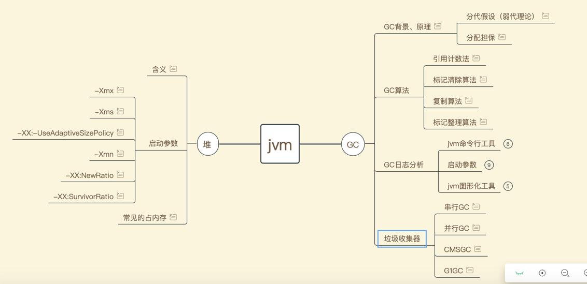

- jvm知识总结见《jvm知识脑图》

对G1分区的理解。
>首先, 堆不再分成连续的年轻代和老年代空间。而是划分为多个(通常是 2048个)可以存放对象的 小堆区(smaller heap regions)。
> 每个小堆区都可能是 Eden区, Survivor区或者Old区. 在 逻辑上, 所有的Eden区和Survivor区合起来就是年轻代, 
> 所有的Old区拼在一起那就是老年代:
G1不划分连续的年轻代和老年代，那么如何判断小块堆属于什么代？
当经历垃圾收集后，存活对象可能会被转移到新的"合适"的小块堆，这个小块堆应该是什么代？

猜想：
 堆属于什么代，是根据其中的对象决定的。
 对象是新创建的，就是Eden区对象，对象经过一次回收存活下来，就是S区对象。
 对象经过多次回收后，并且年龄大于MaxTenuringThreshold的值，就是老年代对象。
 G1垃圾收集时，根据"物以类聚"的规则，将存活的同类对象放在同一个小块堆，小块堆存放的是什么代的对象，这个区域就是什么代。
 同样垃圾收集时，会根据堆属于什么代用对应的垃圾收集算法？
年轻代是串行的标记复制算法吗？

