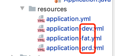

### 1. 创建配置文件
resources目录下建立applicaiton.yml主配置文件，以及各个环境的application-{profile}.yml文件

### 2. 主配置文件配置
applicaiton.yml主配置文件中，配置公共属性，并配置：
```
spring:
    profiles:
        active: @profileActive@
```

### 3.pom文件
pom中profile节点需与配置文件后缀保持一致

```

    <profiles>
        <profile>
            <id>dev</id>
            <properties>
                <profileActive>dev</profileActive>
            </properties>
            <activation>
                <activeByDefault>true</activeByDefault>
            </activation>
        </profile>
        <profile>
            <id>prd</id>
            <properties>
                <profileActive>prd</profileActive>
            </properties>
        </profile>
        <profile>
            <id>fat</id>
            <properties>
                <profileActive>fat</profileActive>
            </properties>
        </profile>
    </profiles>
    

    <build>
        <plugins>
            <plugin>
                <groupId>org.springframework.boot</groupId>
                <artifactId>spring-boot-maven-plugin</artifactId>
                <version>2.4.2</version>
            </plugin>
        </plugins>
        <resources>
            <resource>
                <directory>src/main/resources</directory>
                <excludes>
                    <exclude>application-dev.yml</exclude>
                    <exclude>application-prd.yml</exclude>
                    <exclude>application-fat.yml</exclude>
                </excludes>
                <filtering>true</filtering>
            </resource>
            <resource>
                <directory>src/main/resources</directory>
                <includes>
                    <include>application-${profileActive}.yml</include>
                    <include>application.yml</include>
                    <include>**/*.xml</include>
                </includes>
                <filtering>true</filtering>
            </resource>
        </resources>
    </build>
```
### 4. 使用方法
打包命令
会将application.yml及指定的配置文件打进包中
```
mvn clean package -Dmaven.test.skip=true -P dev -e
```

### 5. 踩坑
5.1 插件找不到，需要添加插件版本号
Plugin 'org.springframework.boot:spring-boot-maven-plugin:' not found
https://www.cnblogs.com/jinit/p/12907158.html