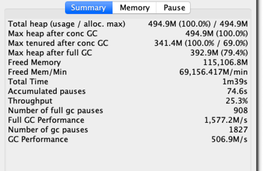
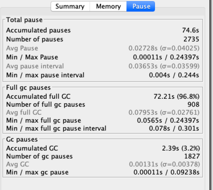
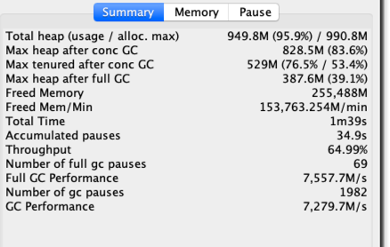
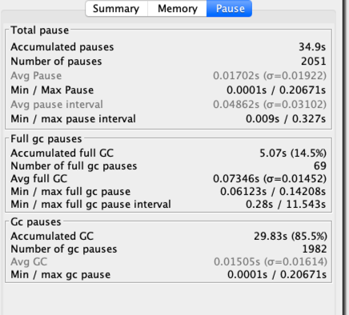
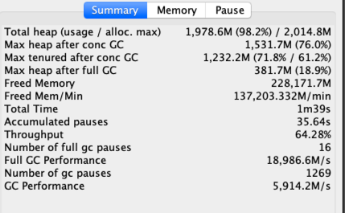
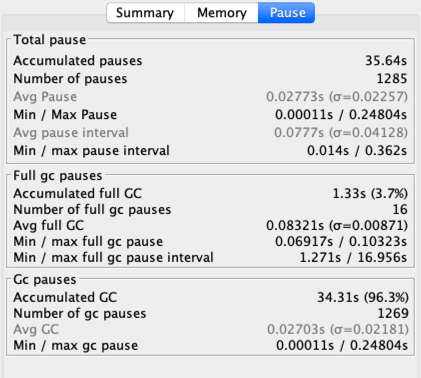
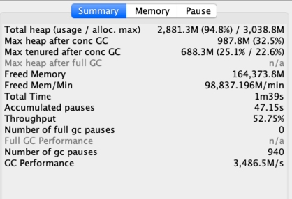
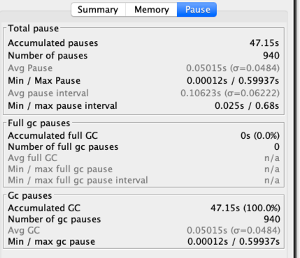
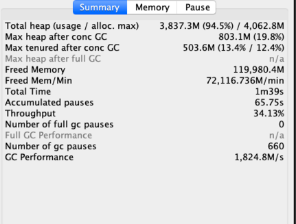
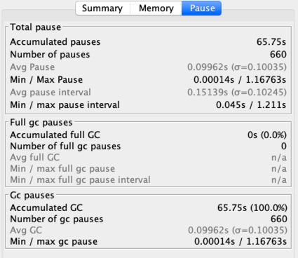

### 1.-Xmx256m -Xms256m
```
java -Xmx256m -Xms256m -XX:+UseConcMarkSweepGC -XX:+PrintGCDetails -XX:+PrintGCDateStamps -Xloggc:gc.demo.log GCLogAnalysis
正在执行...
Exception in thread "main" java.lang.OutOfMemoryError: Java heap space
	at GCLogAnalysis.generateGarbage(GCLogAnalysis.java:48)
	at GCLogAnalysis.main(GCLogAnalysis.java:25)
```
###2. -Xmx512m -Xms512m
```
java -Xmx512m -Xms512m -XX:+UseConcMarkSweepGC -XX:+PrintGCDetails -XX:+PrintGCDateStamps -Xloggc:gc.demo.log GCLogAnalysis
正在执行...
执行结束!共生成对象次数:451508
```


###3. -Xmx1g -Xms1g
```
java -Xmx1g -Xms1g -XX:+UseConcMarkSweepGC -XX:+PrintGCDetails -XX:+PrintGCDateStamps -Xloggc:gc.demo.log GCLogAnalysis
正在执行...
执行结束!共生成对象次数:1277095
```



###4. -Xmx2g -Xms2g
```
java -Xmx2g -Xms2g -XX:+UseConcMarkSweepGC -XX:+PrintGCDetails -XX:+PrintGCDateStamps -Xloggc:gc.demo.log GCLogAnalysis
正在执行...
执行结束!共生成对象次数:1137946
```


###5. -Xmx3g -Xms3g
```
java -Xmx3g -Xms3g -XX:+UseConcMarkSweepGC -XX:+PrintGCDetails -XX:+PrintGCDateStamps -Xloggc:gc.demo.log GCLogAnalysis
正在执行...
执行结束!共生成对象次数:901927
```


###6. -Xmx4g -Xms4g
```
 java -Xmx4g -Xms4g -XX:+UseConcMarkSweepGC -XX:+PrintGCDetails -XX:+PrintGCDateStamps -Xloggc:gc.demo.log GCLogAnalysis
正在执行...
执行结束!共生成对象次数:650270

```


- CMS演练结果

| 堆内存 | 吞吐量 | GC总暂停时间 |Full GC总暂停时间 |并发GC后 老年代最大使用率| 创建对象数量|
| :------| ------: | :------: |------: | :------: |:------: |
| 512m | 25.3% | 74.6s | 72.21s | 69.0% | 451508|
| 1g | 64.99% | 34.9s |5.07s | 53.4% | 1277095|
| 2g | 64.28% | 35.64s |1.33s | 61.2% | 1137946|
| 3g | 52.75% | 47.15s |0s | 22.6% | 901927|
| 4g | 34.13% | 65.75s |0s | 12.4% | 650270|
