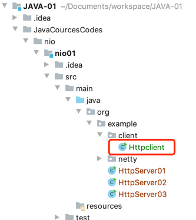

代码路径
JavaCourcesCodes/nio/nio01/src/main/java/org/example/client/Httpclient.java
```
  public static void main(String[] args) {
        CloseableHttpClient client = HttpClientBuilder.create().build();
        HttpGet httpGet = new HttpGet("http://localhost:8802");
        CloseableHttpResponse response = null;

        try {
            response = client.execute(httpGet);
            HttpEntity httpEntity = response.getEntity();
            System.out.println(EntityUtils.toString(httpEntity));

        } catch (IOException e) {
            e.printStackTrace();
        }finally {
            try {
            if (client!=null){
                client.close();
            }
            if (response!=null){
                response.close();
            }
            } catch (IOException e) {
                e.printStackTrace();
            }
        }

    }
```

